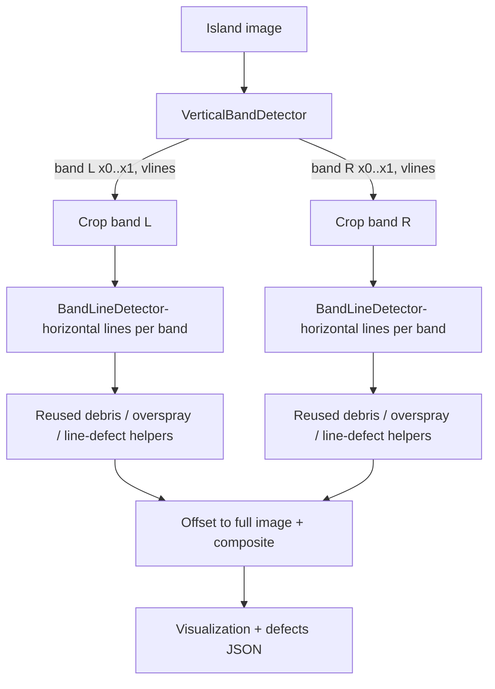

# New-Pattern (Dual-Band) Island Defect Detection

## Problem
The new island pattern is `[V prints V]  gap  [V prints V]` — two horizontal-print bands, each flanked by a pair of vertical boundary lines (4 vertical lines total). The current stack in [scripts/defects_detection/utils/line_detector.py](scripts/defects_detection/utils/line_detector.py) scans horizontal lines inward from the extreme left/right image edges and matches left-to-right by index. On a two-band image this pairs a left-band endpoint with a right-band endpoint across the empty gap, producing invalid slopes and wrong trajectories. The vertical boundary lines are also dark/continuous and would be flagged as debris/overspray.

## Design principles
- Do NOT modify existing detector files. Reuse their per-image helper methods via composition/subclassing.
- Split each island image into its two bands first, then run the existing island logic independently per band, then composite results back into full-image coordinates.
- Vertical lines are structural only: locate them, use them as band boundaries, and paint them out so they are never counted as defects. No defect detection is done on the vertical lines.

## Data flow

## New components (all new files)

### 1. `scripts/defects_detection/utils/vertical_band_detector.py`
Auto-detect the vertical lines and derive the two bands from a column ink-density profile (most robust, no hard-coded coords).
- Grayscale -> `THRESH_BINARY_INV` (dark ink -> white), same convention as `LineDetector`.
- `col_frac = (binary>0).sum(axis=0) / height`; smooth with a 1D box filter.
- Vertical lines = columns with `col_frac > vline_thresh` (tall continuous ink, e.g. > 0.5); group consecutive columns into line objects (center x + thickness).
- Bands = contiguous runs with `col_frac > content_min` separated by a wide low-density gap (the central white gap). Each run is one print block including its two boundary vertical lines.
- Output per band: `x0, x1` (crop bounds), `vline_xs` (boundary-line centers, in full-image x), `inner_x0, inner_x1` (print span just inside the vertical lines).
- Robust fallbacks: if not exactly 4 vertical peaks, fall back to the two density-run bands and take the run edges as boundaries; if only one run is found, degrade to single-band (old behavior) and log a warning.

### 2. `scripts/defects_detection/utils/band_line_detector.py`
`class BandLineDetector(LineDetector)` — thin subclass so horizontal-line detection runs on a band crop but scales kernels to the FULL image, not the narrow crop.
- Constructor takes `reference_width` (full image width).
- Override `calculate_scaled_kernel_dimensions` / `update_kernel_dimensions_for_image` to compute `width_scale` from `reference_width` instead of the crop width (keeps `kernel_width` and `num_vertical_scans` physically correct; `Y_DELTA` and slope logic already depend only on height and are unchanged).
- Everything else (`scan_from_left`, `scan_from_right`, `match_lines`, ghost insertion, slope validation) is inherited unchanged. Returned endpoints are band-local; callers add `+band.x0` to map to full image.

### 3. Per-band orchestrating detectors (reuse existing helpers by composition)
Each new detector detects bands once, then loops bands reusing the existing detector's helpers, offsets coordinates, and builds ONE full-image visualization.

- `scripts/defects_detection/new_pattern_debris_island_detection.py` (`NewPatternDebrisIslandDetector`)
  - Per band: crop -> `BandLineDetector.detect_lines(crop)` -> `existing.remove_lines_from_image(gray_crop, matched)` -> paint band `vline_xs` white (new vertical-line removal step) -> `existing.detect_debris(lines_removed)` -> offset contour x by `band.x0` -> accumulate.
  - Final: `existing.create_debris_visualization(image, all_contours, [])`.
- `scripts/defects_detection/new_pattern_overspray_island_detection.py` (`NewPatternOversprayIslandDetector`)
  - Same band loop but reuse `existing.detect_colored_regions` + `existing.group_nearby_regions` (grouping stays within a band to avoid merging across the gap); offset regions; reuse `create_overspray_visualization`.
- `scripts/defects_detection/new_pattern_line_defect_detection.py` (`NewPatternLineDefectDetector`)
  - Per band: `BandLineDetector.detect_lines(crop)`, binarize crop, reuse `existing.scan_line_for_defects` per matched line; offset `start_x/end_x/x/location` by `band.x0`; accumulate missing/jagged; reuse `create_combined_visualization`.
  - Robustness add-on: skip invalid-slope lines for the walk (current code walks all), and use the band's median slope/spacing to place/repair ghost trajectories.

### 4. Vertical-line removal helper (shared)
Small function (in `vertical_band_detector.py`) `paint_vertical_lines_white(gray, vline_xs, thickness)` used by the debris/overspray band loops so boundary lines never become false positives. Analogous to the existing horizontal `remove_lines_from_image`.

### 5. Pipeline integration (additive only)
- Add `NewPatternIslandDetectionStrategy` in [scripts/defects_detection/run_all_detections.py](scripts/defects_detection/run_all_detections.py) plus a `--pattern {legacy,new}` CLI flag (default `legacy`) that swaps `IslandDetectionStrategy` for the new one. No existing class is edited; only new branches/keys are added.
- Add factory methods for the three new detectors mirroring the existing `create_*_island_detector` methods.

### 6. Docs
Add a "New-Pattern (Dual-Band) Island" section to [scripts/defects_detection/ALGORITHMS.md](scripts/defects_detection/ALGORITHMS.md) describing band detection, per-band reuse, and vertical-line removal.

## Robustness vs. the current algorithm
- Eliminates cross-band false matching (the core failure of applying the old detector to two bands).
- Auto band/vertical-line detection with density-run fallback and single-band degrade.
- Explicit vertical-line removal prevents new false debris/overspray.
- Kernel scaling referenced to full image keeps line detection sensitivity identical to today.
- Per-band grouping and median-slope ghost repair for line defects.

## Validation
- Dry-run on a sample new-pattern island crop with `debug=True`; confirm 2 bands, ~4 vertical lines, correct per-band horizontal-line counts, and that vertical lines are not flagged. Compare against a legacy single-band island to confirm no regression when `--pattern legacy`.