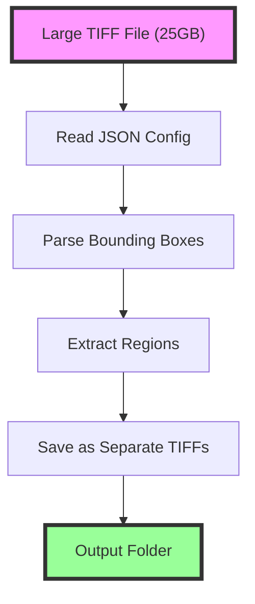

# TIFF Region Extractor

A Python script for efficiently extracting regions from large TIFF files (25GB+) based on bounding box coordinates. This tool is designed for processing scanned images from printers with multi-heads and small nozzles, where only specific regions need to be analyzed.

## Features

- **Memory-efficient**: Handles very large TIFF files without loading the entire image into memory
- **Preserves quality**: Maintains original resolution and image metadata
- **Batch processing**: Extract multiple regions from a single TIFF file
- **Progress tracking**: Real-time progress bars using tqdm
- **Command-line interface**: Easy to use from terminal/command prompt
- **Flexible input**: Accepts JSON file path or JSON string directly


  
## Installation

### 1. Create a conda environment (recommended)

```bash
conda create -n tiff_extractor python=3.10
conda activate tiff_extractor
```

### 2. Install dependencies

```bash
pip install -r requirements.txt
```

## Usage

### Command Line Interface

The script can be run from the command line with a JSON configuration:

```bash
# Using a JSON file
python scripts/tiff_extractor.py config.json

# Using a JSON string directly
python scripts/tiff_extractor.py '{"original_image_path": "path/to/image.tiff", "sub_images": [...]}'

# With verbose logging
python scripts/tiff_extractor.py config.json --verbose
```

### JSON Configuration Format

The configuration should follow this structure:

```json
{
  "original_image_path": "F:/DeepLearning/NikePProject/test_images/test_image.tiff",
  "sub_images": [
    {
      "name": "redBox",
      "bounding_box_pixels": {
        "top_x": 42.97521,
        "top_y": -38.26446,
        "bottom_x": 247.69044,
        "bottom_y": -194.04729
      }
    },
    {
      "name": "blue_Box",
      "bounding_box_pixels": {
        "top_x": 515.83093,
        "top_y": -514.77457,
        "bottom_x": 731.38465,
        "bottom_y": -674.09688
      }
    }
  ]
}
```

#### Configuration Parameters:

- `original_image_path`: Full path to the input TIFF file
- `sub_images`: Array of regions to extract
  - `name`: Name for the output file (will be saved as `{name}.tiff`)
  - `bounding_box_pixels`: Coordinates defining the region
    - `top_x`, `top_y`: Top-left corner coordinates
    - `bottom_x`, `bottom_y`: Bottom-right corner coordinates

**Note**: The script handles negative coordinates by converting them to positive values automatically.

### Python API

You can also use the script programmatically:

```python
from scripts.tiff_extractor import extract_region_from_tiff, process_tiff_with_config

# Extract a single region
success = extract_region_from_tiff(
    tiff_path="input.tiff",
    top_x=100,
    top_y=100,
    bottom_x=500,
    bottom_y=500,
    output_path="output.tiff"
)

# Process multiple regions using configuration
config = {
    "original_image_path": "input.tiff",
    "sub_images": [
        {
            "name": "region1",
            "bounding_box_pixels": {
                "top_x": 0,
                "top_y": 0,
                "bottom_x": 1000,
                "bottom_y": 1000
            }
        }
    ]
}
results = process_tiff_with_config(config)
```

## Output Structure

The script creates an output directory in the same location as the input image:

```
input_directory/
├── test_image.tiff          # Original image
└── test_image_output/       # Output directory
    ├── redBox.tiff         # Extracted region 1
    └── blue_Box.tiff       # Extracted region 2
```

## API Reference

### `extract_region_from_tiff()`

Extract a specific region from a TIFF file and save it as a new TIFF.

**Parameters:**
- `tiff_path` (str): Path to the input TIFF file
- `top_x` (int): X coordinate of top-left corner
- `top_y` (int): Y coordinate of top-left corner
- `bottom_x` (int): X coordinate of bottom-right corner
- `bottom_y` (int): Y coordinate of bottom-right corner
- `output_path` (str): Path where the extracted region will be saved

**Returns:**
- `bool`: True if extraction was successful, False otherwise

### `process_tiff_with_config()`

Process a TIFF file based on configuration containing bounding boxes.

**Parameters:**
- `config` (Union[str, Dict]): Either a path to JSON file or a dictionary with configuration

**Returns:**
- `Dict[str, bool]`: Dictionary with extraction results for each sub-image

## Performance Considerations

- The script uses memory mapping to avoid loading the entire TIFF file into memory
- Only the required regions are loaded and processed
- No compression is applied to output files for faster processing
- Original metadata (resolution, color space, etc.) is preserved

## Error Handling

- Invalid file paths are logged and skipped
- Malformed JSON is caught and reported
- Failed extractions are tracked and reported in the results
- Exit codes: 0 for success, 1 if any extraction failed

## Requirements

- Python 3.7+
- tifffile: For efficient TIFF file handling
- numpy: For array operations
- tqdm: For progress bars

## Example Test Run

```bash
# Create test configuration
echo '{
  "original_image_path": "F:/DeepLearning/NikePProject/test_images/test_image.tiff",
  "sub_images": [
    {
      "name": "test_region",
      "bounding_box_pixels": {
        "top_x": 0,
        "top_y": 0,
        "bottom_x": 100,
        "bottom_y": 100
      }
    }
  ]
}' > test_config.json

# Run extraction
python scripts/tiff_extractor.py test_config.json
```

## License

This script is provided as-is for the Nike P Project. 